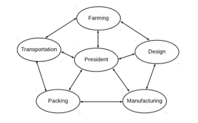
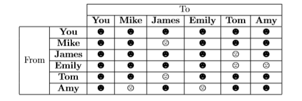

# Constraint Satisfaction Problems

You are a famous entrepreneur of enterprice
. You are opening a new dependency, which requires the development of a supply chain. You have defined five workstations, which needs the good/service from the previous one. The workstations are: farming, design, manufacturing, packaging, and transportation.: 

  

You have 5 people available to be the chief of each workstation (no one can be the chief of two or more stations). However, they can be extremely arrogant with some of each other. You, as president of enterprice, want to guarantee harmonious relationships between consecutive workstations. The head of human resources have brought you the following chart that shows the level of compatibility between your personal:

  

Result
==========================

SCRIPT ----------------------------------------------------------------------------
csp2 (ver. Unknown)
Andrea Rey, Jose Lopez

This is a report lab CSP
-----------------------------------------------------------------------------------------

START ALGORITM ..... ASSIGNAMENT AREAS --------------------------------------------------
                                                      Tuesday 09/04/18, 20:25:32
----------------------------------------------------------------------------

BACKTRACK : 1 -----------------------------------------------------------------------------

.

CSP with assignment:{'Farming': 'Mike'}

Farming-> Mike, 

Desing-> Emily, Tom, 

Manufacturing-> Mike, James, Emily, Tom, Amy, 

Packing-> Mike, James, Emily, Tom, Amy, 

Trasportation-> Emily, Tom, 

BACKTRACK : 2 __________________________________________________________________

.

CSP with assignment:{'Farming': 'Mike', 'Desing': 'Emily'}

Farming-> Mike, 

Desing-> Emily, 

Manufacturing-> James, 

Packing-> Mike, James, Emily, Tom, Amy, 

Trasportation-> Tom, 

BACKTRACK : 3 __________________________________________________________________

.

CSP with assignment:{'Farming': 'Mike', 'Desing': 'Emily', 'Manufacturing': 'James'}

Farming-> Mike, 

Desing-> Emily, 

Manufacturing-> James, 

Packing-> Amy, 

Trasportation-> Tom, 

BACKTRACK : 4 __________________________________________________________________

.

CSP with assignment:{'Farming': 'Mike', 'Desing': 'Emily', 'Manufacturing': 'James', 'Packing': 'Amy'}

Farming-> Mike, 

Desing-> Emily, 

Manufacturing-> James, 

Packing-> Amy, 

Trasportation-> Tom, 

BACKTRACK : 5 __________________________________________________________________

.

CSP with assignment:{'Farming': 'Mike', 'Desing': 'Emily', 'Manufacturing': 'James', 'Packing': 'Amy', 'Trasportation': 'Tom'}

Farming-> Mike, 

Desing-> Emily, 

Manufacturing-> James, 

Packing-> Amy, 

Trasportation-> Tom, 

END TIME =======================================================================
                                                      Tuesday 09/04/18, 20:25:32
================================================================================
